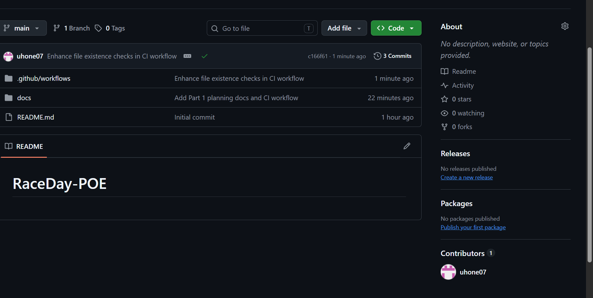

# RaceDay-POE

RaceDay is a full-stack web-based event management system built for the South African road running, walking, and cycling community. It allows Event Organisers to create and manage events, categories, and participant results, while Participants can browse upcoming events, enter events, and track their personal performance history.

This repository contains the Portfolio of Evidence (POE) for PROG6212, submitted in three parts:

- **Part 1:** System planning — ERD, API endpoint plan, and SQL database script (this submission)
- **Part 2:** RESTful API built in C# with unit tests and CI/CD
- **Part 3:** MVC web application with Azure Blob Storage and Docker

## User Roles

- **Organiser** — can create, edit, and delete events, manage event categories, capture participant results, and view all event enrolments.
- **Participant** — can create an account, browse events, enter an event by selecting a category, view their own enrolments, and track their personal results.

## Part 1 Deliverables (/docs folder)

- `RaceDay_ERD.png` — Entity Relationship Diagram covering all 6 entities, keys, and relationships
- `RaceDay_API_Endpoint_Plan.md` — Full API endpoint plan covering Authentication, Profile, Events, Categories, Enrolments, and Results
- `RaceDay_Database.sql` — SQL Server script creating the schema and seeding sample data

## CI/CD

A GitHub Actions workflow validates that the required Part 1 files are present in `/docs` on every push.

## Video Presentation

[Watch the Part 1 walkthrough video here PASTE_YOUR_YOUTUBE_LINK_HERE
